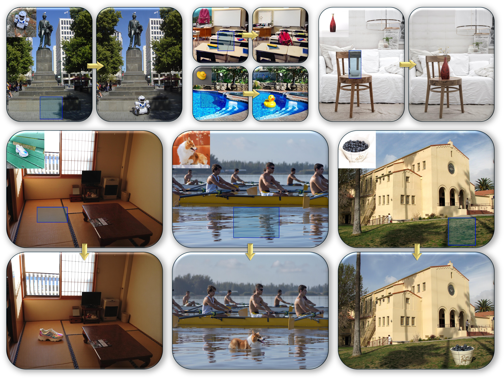

<div align="center">
<h1>[ICLR 2026] Does FLUX Already Know How to Perform Physically Plausible Image Composition?</h1>

Shilin Lu<sup>1,\*</sup>, 
Zhuming Lian<sup>1,\*</sup>,
Zihan Zhou<sup>1</sup>,
Shaocong Zhang<sup>1</sup>,
Chen Zhao<sup>2</sup>,
Adams Wai-Kin Kong<sup>1</sup>

<sup>1</sup>Nanyang Technological University, <sup>2</sup>Nanjing University 

<sup>*</sup>Equal Contribution

<!-- [Paper](https://arxiv.org/abs/2509.21278) | [Project Page](https://ZhumingLian.github.io) -->
<!-- <a href='https://ZhumingLian.github.io/'></a> -->
[](https://arxiv.org/abs/2509.21278) [](https://huggingface.co/ZhumingLian/Shine_lora_ckpts) [](https://huggingface.co/datasets/ZhumingLian/ComplexCompo) [](https://huggingface.co/datasets/ZhumingLian/Shine-DreamEditBench) 

</div>

>**Abstract**: <br>
Image composition aims to seamlessly insert a user-specified object into a new scene, but existing models struggle with complex lighting (e.g., accurate shadows, water reflections) and diverse, high-resolution inputs. Modern text-to-image diffusion models (e.g., SD3.5, FLUX) already encode essential physical and resolution priors, yet lack a framework to unleash them without resorting to latent inversion, which often locks object poses into contextually inappropriate orientations, or brittle attention surgery. We propose SHINE, a training-free framework for Seamless, High-fidelity Insertion with Neutralized Errors. SHINE introduces manifold-steered anchor loss, leveraging pretrained customization adapters (e.g., IP-Adapter) to guide latents for faithful subject representation while preserving background integrity. Degradation-suppression guidance and adaptive background blending are proposed to further eliminate low-quality outputs and visible seams. To address the lack of rigorous benchmarks, we introduce ComplexCompo, featuring diverse resolutions and challenging conditions such as low lighting, strong illumination, intricate shadows, and reflective surfaces. Experiments on ComplexCompo and DreamEditBench show state-of-the-art performance on standard metrics (e.g., DINOv2) and human-aligned scores (e.g., DreamSim, ImageReward, VisionReward). Code and benchmark will be publicly available upon publication.




## Contents
  - [Quick Start](#quick-start)
    - [Environment Setup](#environment-setup)
    - [Checkpoints and Dataset Preparation](#checkpoints-and-dataset-preparation)
    - [Repository Structure](#repository-structure)
  - [Inference](#inference)
  - [Evaluation](#evaluation)
  - [Acknowledgement](#acknowledgement)
  - [Citation](#citation)

## Quick Start

<!-- ### Requirements

```
Python >= 3.10, PyTorch >= 2.0, CUDA >= 11.8
``` -->

### Environment Setup

```
conda create -n shine python=3.13 -y
conda activate shine
pip install torch torchvision torchaudio --index-url https://download.pytorch.org/whl/cu118
pip install image-reward
pip install -r requirements.txt
```

### Checkpoints and Dataset Preparation

#### 1. InstantCharacter Checkpoints

Please refer to the [InstantCharacter](https://github.com/Tencent-Hunyuan/InstantCharacter) repository to obtain the adapter checkpoints and place them in the `./ckpts/adapter_ckpts` directory.

Alternatively, you can download the checkpoints via the HuggingFace CLI:

```bash
hf download Tencent/InstantCharacter --local-dir ./ckpts/adapter_ckpts
```

#### 2. LoRA Checkpoints

The LoRA weights used in our experiments are available on HuggingFace: [Shine_lora_ckpts](https://huggingface.co/ZhumingLian/Shine_lora_ckpts). Download them with:

```
hf download ZhumingLian/Shine_lora_ckpts --local-dir ./ckpts/LoRA_ckpts
```

#### 3. IRF Evaluation Checkpoints

Please follow the instructions in the
[1st-Place-Solution-in-Google-Universal-Image-Embedding](https://github.com/ShihaoShao-GH/1st-Place-Solution-in-Google-Universal-Image-Embedding?tab=readme-ov-file) to obtain the IRF evaluation checkpoints and place the downloaded files in `ckpts/IRF_ckpts/` directory.

#### 4. Datasets

The datasets used in our experiments are available on Hugging Face:

- **[Shine-DreamEditBench](https://huggingface.co/datasets/ZhumingLian/Shine-DreamEditBench)**: a reformatted version of DreamEditBench  
- **[ComplexCompo](https://huggingface.co/datasets/ZhumingLian/ComplexCompo)**: our benchmark dataset for evaluating physically plausible image composition

Please download with:

```
hf download --repo-type dataset ZhumingLian/Shine-DreamEditBench --local-dir ./datasets/Shine-DreamEditBench
hf download --repo-type dataset ZhumingLian/ComplexCompo --local-dir ./datasets/ComplexCompo
```

### Repository Structure

```
.
├── assets/
├── ckpts/
│   ├── adapter_ckpts/                   # Pretrained Adapter weights
│   │   └── instantcharacter_ip-adapter.bin
│   ├── dream_sim_ckpts/                 # dream_sim metric cache directory
│   ├── IRF_ckpts/                       # IRF metric checkpoints
│       └── arcface all vith 18 last and middle first 3 280 all 3 290 first 1 overlap last 6 middle 6 first 3 dropout.pth
│   └── LoRA_ckpts/
│       └── instance/
│           └── pytorch_lora_weights.safetensors
├── datasets/                            # Benchmark datasets
│   ├── DreamEditBench/
│   └── ComplexCompo/
│       └── instance/
│           ├── bg/
│           │   ├── 0_512_rect.png       # resized image from 0.jpg with a short side of 512
│           │   ├── 0_512_square.png     # cropped image from 0_512_rect.png
│           │   ├── 0_768_rect.png       # resized image from 0.jpg with a short side of 768
│           │   ├── 0_768_square.png     # cropped image from 0_768_rect.png
│           │   ├── 0_w_mask.png         # 0_768_rect.png with bbox
│           │   ├── 0.jpg                # original background image
│           │   ├── content_512.json     # contains prompt and bbox information, match with 0_768_square.png
│           │   ├── content_768.json     # contains prompt and bbox information, match with 0_512_square.png
│           │   └── content.json         # contains prompt and bbox information, match with 0_768_rect.png
│           └── fg/
│               ├── 00.jpg               # reference image
│               └── 00.png               # mask image
├── evaluation/                          # evaluation scripts
│   ├── evaluation_complexcompo.py
│   ├── evaluation_dreameditbench.py
│   └── evaluation.py                    # single image evaluation
├── examples/                            # Example inputs
│   ├── instance/
│   │   ├── bg/
│   │   │   ├── bg.jpg                   # background image
│   │   │   └── content.json             # contains bbox information
│   │   └── fg/
│   │       ├── 00.jpg                   # reference image
│   │       └── 00.png                   # mask image
│   └── eval_image_metrics_config.json   # evaluation content configuration
├── models/                              # Model framework
│   ├── adapter/
│   │   ├── attn_processor.py
│   │   ├── norm_layer.py
│   │   ├── pipeline.py
│   │   ├── resampler.py
│   │   └── utils.py
│   ├── lora/
│   │   ├── SHINE_attn_processor.py
│   │   └── SHINE_pipeline_flux.py
│   └── SHINE_transformer_flux.py
├── scripts/                             # Experiment scripts
│   ├── Complexcompo                     # running on ComplexCompo dataset
│   │   ├── main_adapter.py
│   │   └── main_lora.py
│   ├── Dreambooth                       # running on DreamEditBench dataset                  
│   │   ├── main_adapter.py
│   │   └── main_lora.py          
│   ├── main_adapter.py                  # Adapter inference script
│   └── main_lora.py                     # LoRA inference script
├── tools/                               # evaluation tools
│   │── cladapter_score.py
│   ├── dinov2_score.py
│   └── IRF_score.py
├── .gitignore
├── README.md
└── requirements.txt
```

## Inference

For single image inference, the commands are as follows:
```
# Adapter
CUDA_VISIBLE_DEVICES=0 python scripts/main_adapter.py \
--input_path examples/cat/bg/content.json \
--enable_model_cpu_offload True

# LoRA
CUDA_VISIBLE_DEVICES=0 python scripts/main_lora.py \
--input_path examples/cat/bg/content.json \
--enable_model_cpu_offload True
```

The result image will be saved to:

```
examples/cat/result.png
```

For running Shine-DreamEditBench and ComplexCompo datasets, the commands are as follows:
```
# Adapter
CUDA_VISIBLE_DEVICES=0 python scripts/Dreambooth/main_adapter.py \
--dataset_dir datasets/Shine-DreamEditBench \
--output_dir outputs_dreameditbench/test_adapter \
--enable_model_cpu_offload True

CUDA_VISIBLE_DEVICES=0 python scripts/Complexcompo/main_adapter.py \
--dataset_dir datasets/ComplexCompo \
--output_dir outputs_complexcompo/test_adapter \
--enable_model_cpu_offload True

# LoRA
CUDA_VISIBLE_DEVICES=0 python scripts/Dreambooth/main_lora.py \
--dataset_dir datasets/Shine-DreamEditBench \
--output_dir outputs_dreameditbench/test_lora \
--enable_model_cpu_offload True

CUDA_VISIBLE_DEVICES=0 python scripts/Complexcompo/main_lora.py \
--dataset_dir datasets/ComplexCompo \
--output_dir outputs_complexcompo/test_lora \
--enable_model_cpu_offload True
```

## Evaluation

For single example evaluation, please use the command:
```
CUDA_VISIBLE_DEVICES=0 python evaluation/evaluation.py \
--evaluation_file examples/eval_image_metrics_config.json
```

For Shine-DreamEditBench and ComplexCompo datasets evaluation, please use the following commands:
```
CUDA_VISIBLE_DEVICES=0 python evaluation/evaluation_dreameditbench.py \
--dataset_dir datasets/Shine-DreamEditBench \
--results_dir outputs_dreameditbench

CUDA_VISIBLE_DEVICES=0 python evaluation/evaluation_complexcompo.py \
--dataset_dir datasets/ComplexCompo \
--results_dir outputs_complexcompo
```

## Acknowledgement

We thank the following contributors that our code and benchmark are based on: [HuggingFace](https://huggingface.co), [Diffusers](https://github.com/huggingface/diffusers), [InstantCharacter](https://github.com/Tencent-Hunyuan/InstantCharacter).

## Citation

If you find this work useful, please cite:

```
@article{lu2025does,
  title={Does flux already know how to perform physically plausible image composition?},
  author={Lu, Shilin and Lian, Zhuming and Zhou, Zihan and Zhang, Shaocong and Zhao, Chen and Kong, Adams Wai-Kin},
  journal={arXiv preprint arXiv:2509.21278},
  year={2025}
}
```